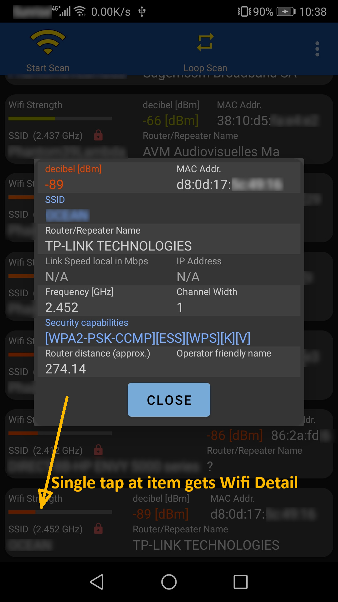

# WifiProbe

WifiProbe scans and displays Wifi access points in your environment.

## Description

The app registers a broadcast listener for the Wifi scanner (WifiManager.EXTRA_RESULTS_UPDATED).
Instead using the WifiManager.startScan(), it starts and stops immediately the wifi action panel, that trigger a wifi scan. So there is no limit for number of scan per minute, as with startScan().

|Toolbar|Wifi Results|Wifi Details|
|-------|------------|------------|
|||

|Long press|Connect to SSID|
|----------|-------|
|||

## Getting Started

### Dependencies

* Minimum Android version API 26 (Oreo 8.0), target version API 30 (Android 11)

### Installing

* 

## Help

## Authors

Martin Koch

## Special

### Determination of the manufacturer name of the router

An organizationally unique identifier (OUI) number uniquely identifies a vendor or manufacturer.
In MAC addresses, the OUI is combined with a 24-bit number (assigned by the assignee of the OUI) to form the address. The first three octets of the address are the OUI.
[Wikipedia about OUI](https://en.wikipedia.org/wiki/Organizationally_unique_identifier).
WifiProbe uses following lookup file: [The IEEE public OUI listings](http://standards-oui.ieee.org/oui/oui.csv).

## Version History

* 1.0
  * Initial version of the App

## License

This project is licensed under the [Apache License 2.0](https://github.com/NetVarg/WifiProbe/blob/main/LICENSE).
